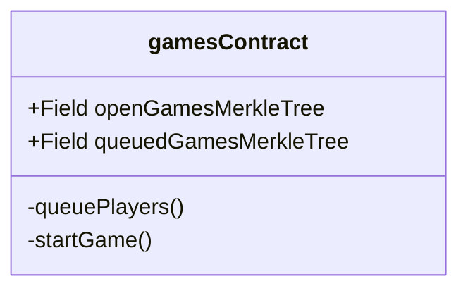
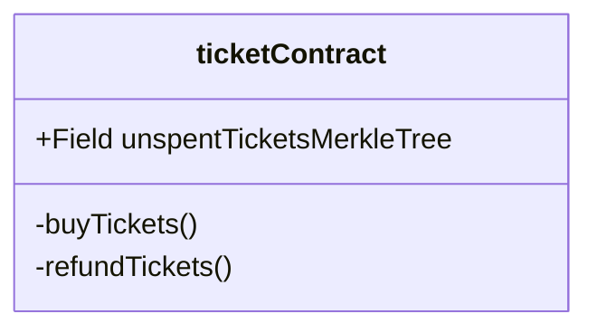
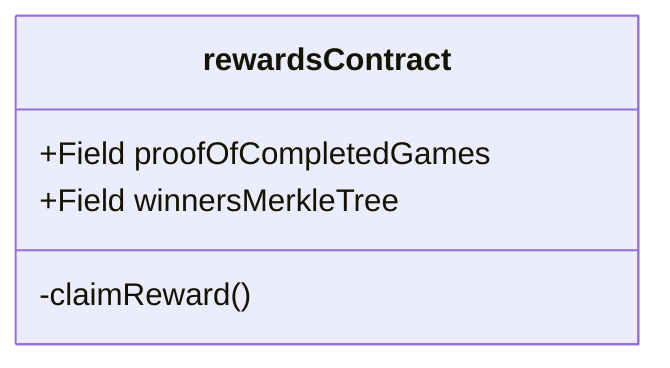
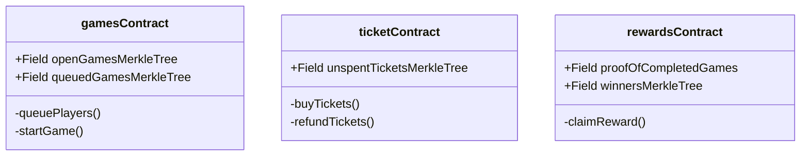

# Tournament Smart Contracts
The following contracts relate to the tournament architecture of Tower of Greed using Mina L1.

## Games Contract

Responsible for keeping track of open and available games that players can join.

Game Node interacts with this s.c. for processing the various stages of all existing game instances.

## Ticket Contract

Responsible for allowing players to buy tournament tickets and keeping track of unspent tickets

Players interact with this s.c. to buy tournament tickets, which are used to enter a ToG session.

## Ticket Contract

Responsible for allowing eligible winners of ToG sessions to claim their token prizes.

Winning players interact with this s.c. to claim their rewards after winning a ToG session.

## Contract Interactions

TODO

